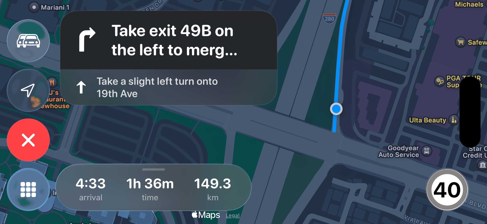
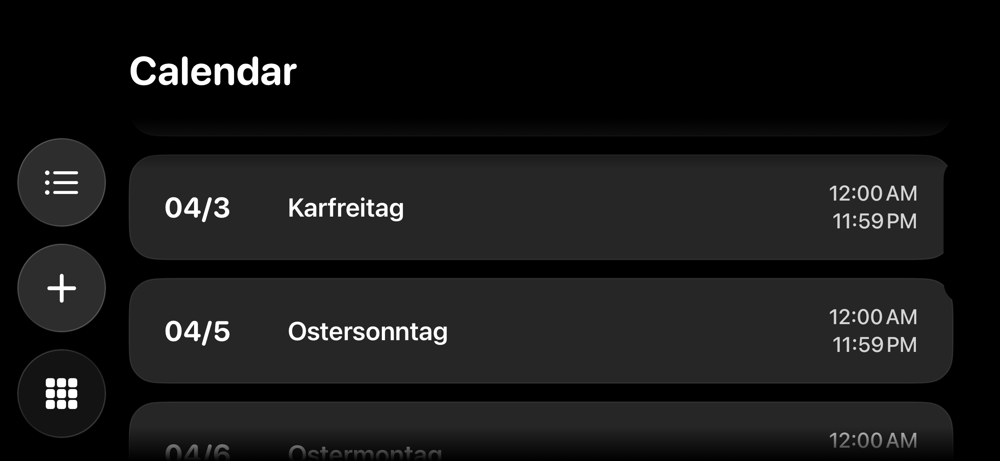
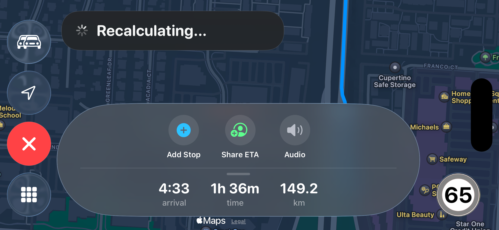
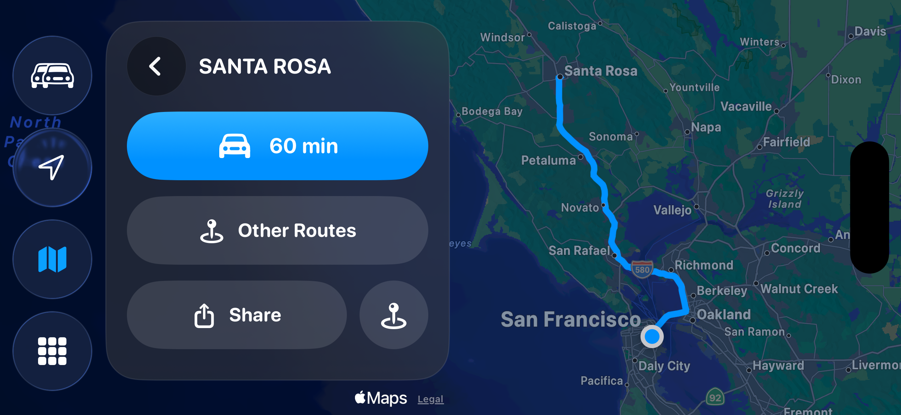

# CruiseOS
An iOS app mimicking Apple Carplay.

I'm building this because I wanted a dashboard that actually feels like it belongs in a modern car. It’s heavily inspired by that Apple aesthetic, clean lines, "liquid glass" blurs, and a UI that stays out of your way.

### What’s in the box (so far):

* **The Glass Look:** I’ve spent a lot of time on the "liquid glass" effect. It’s transparent, modern, and looks great on a tablet or head unit.
* **The Main Dash:** A unified home view where you’ve got your maps window on one side and your **Apple Music** controls on the other.
* **Top Widget:** A quick-glance widget at the top for your **Calendar** entries so you don't miss that next meeting while you're driving.
* **Maps & Navigation:** You can search for spots, pin your favorites, and even try out the turn-by-turn.

**Real talk (Read this first)**

I’m still deep in the "building" phase, so there are two things you need to know before you start driving with this:

1. **Turn-by-Turn Navigation:** It’s very early-stage. It works, but it's a total WIP. Treat it as a "for testing only" feature. Please don’t rely on it to get you to an interview—cross-check it with your phone or a dedicated GPS.
2. **Speed Limit Detection:** Also experimental. It might get it right, it might not. Always keep your eyes on the actual road signs.

Basically: **Use this for testing and feedback, not as your primary way to navigate.**

---

**Help me make this better**

I’m just one guy working on this, and full disclosure—I’m actually using AI to help me build and code this whole thing. I’d love to know what’s breaking or where the logic feels a bit clunky.

Since I'm using AI to move fast, I’m still figuring out some of the weird edge cases. If you find a bug or have a "this would be cool" idea, head over to the [Issues] tab and let me know. Screenshots of the UI on your specific screen would be super helpful. Make sure you're on iOS 26. :)

---

Some Screenshots:

